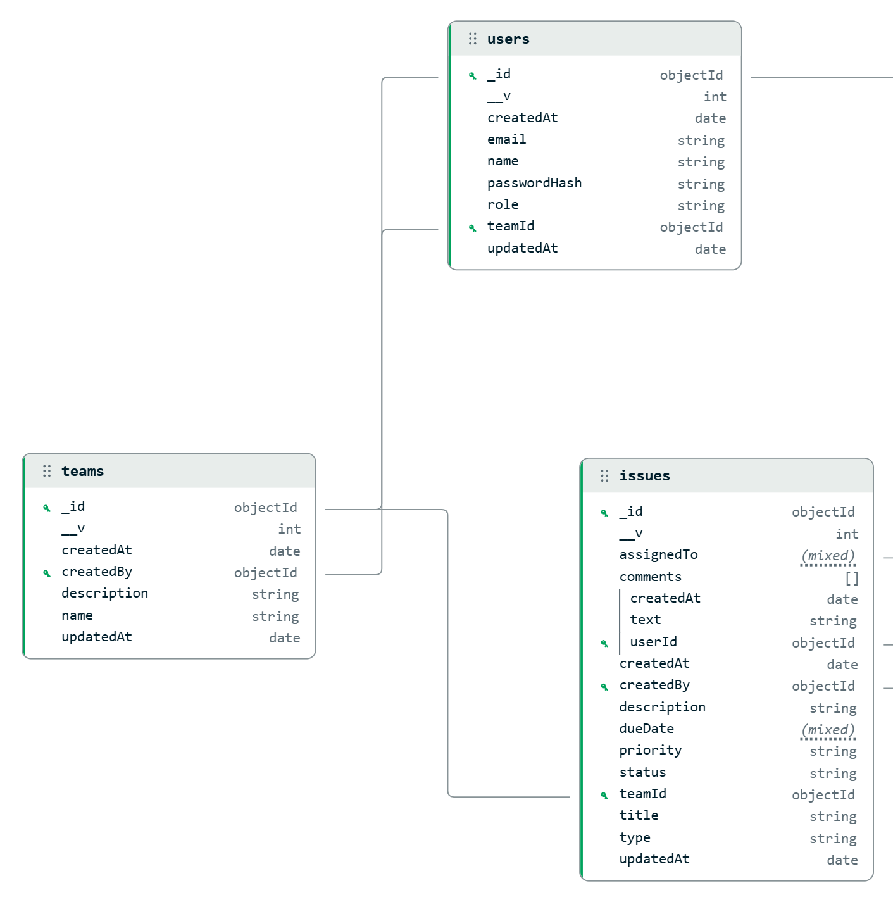

# Trackly

> A full-stack, team-based issue tracker built for engineering teams to manage bugs, feature requests, and workflows with a clean Kanban board and real-time analytics.

[](./LICENSE)
[](https://www.typescriptlang.org/)
[](https://react.dev/)
[](https://nodejs.org/)
[](https://www.mongodb.com/)

---

## Live Demo

| | URL |
|---|---|
| **Frontend** | https://client-bay-six-49.vercel.app |
| **Backend API** | https://trackly-q398.onrender.com |

> Test accounts are available on the login page — pick **Admin** or **Member** to explore without signing up.

---

## Overview

Trackly is a collaborative issue tracking application. A user signs up, creates a team (becoming its `ADMIN`), invites members, and manages work through a structured workflow. Issues can be assigned, prioritized, commented on, and tracked on a drag-and-drop Kanban board. Admins get a real-time analytics dashboard for team-wide progress visibility.

---

## Database Design



Three collections keep the data model simple and avoid redundancy:

- **User** holds a `teamId` reference — no members array on Team. Members are found by querying `User.teamId`.
- **Team** stores only metadata and a `createdBy` pointer.
- **Issue** embeds comments as a sub-document array since comments have no independent lifecycle.

---

## Features

| Feature | Description |
|---|---|
| **Authentication** | JWT in httpOnly cookies with bcrypt password hashing |
| **Team Workspaces** | Isolated environments; one team per user |
| **Role-Based Access** | `ADMIN` and `MEMBER` roles enforced in middleware |
| **Issue Management** | Full CRUD with type, priority, assignee, due date, and comments |
| **Status Workflow** | `TODO` → `IN_PROGRESS` → `DONE` |
| **Kanban Board** | Drag-and-drop with optimistic UI updates and automatic rollback |
| **Issue Filtering** | Server-side filtering by status, type, priority, assignee, and full-text search |
| **Analytics Dashboard** | Status breakdown, priority distribution, trend chart, and per-member workload |
| **Theme Support** | System-aware dark / light mode |

---

## Tech Stack

### Frontend

| Layer | Technology |
|---|---|
| Framework | React 19 + TypeScript |
| Build Tool | Vite |
| Styling | Tailwind CSS v4 |
| State | Redux Toolkit + RTK Query |
| Routing | React Router DOM v7 |
| UI | Shadcn / Radix primitives, Lucide icons |
| Charts | Recharts |
| Drag & Drop | @dnd-kit |
| Forms | React Hook Form + Zod |
| Notifications | Sonner |

### Backend

| Layer | Technology |
|---|---|
| Runtime | Node.js 18+ + TypeScript |
| Framework | Express.js v5 |
| Database | MongoDB + Mongoose |
| Auth | JWT + httpOnly cookies |
| Passwords | bcryptjs |
| Validation | Zod |
| Security | Helmet, CORS, cookie-parser |
| Logging | Morgan |

---

## Project Structure

```text
Trackly/
├── client/                   # React + Vite frontend
│   └── src/
│       ├── components/       # Reusable UI components
│       ├── pages/            # Route views
│       ├── layout/           # RootLayout, AuthLayout, AppShell
│       ├── services/         # RTK Query API slices
│       ├── store/            # Redux store + authSlice
│       ├── hooks/            # Custom hooks
│       ├── lib/              # Utilities, API config
│       ├── types/            # TypeScript domain types
│       └── routes.tsx        # Route tree
│
└── server/                   # Express REST API
    └── src/
        ├── controllers/      # Route handlers
        ├── models/           # Mongoose schemas
        ├── routers/          # Express routers
        ├── middlewares/      # JWT, RBAC, Zod validation, error handler
        ├── validators/       # Zod request schemas
        ├── config/           # DB + environment config
        ├── utils/            # JWT helpers, response wrappers
        └── seed.ts           # Demo data seeder
```

---

## API Overview

```
POST   /api/auth/signup
POST   /api/auth/login
POST   /api/auth/logout

GET    /api/users/me
PATCH  /api/users/me
GET    /api/users/search?q=

POST   /api/teams
GET    /api/teams/my
GET    /api/teams/my/members
PATCH  /api/teams/my            (ADMIN)
DELETE /api/teams/my            (ADMIN)
POST   /api/teams/my/members    (ADMIN)
DELETE /api/teams/my/members/:id (ADMIN)

GET    /api/issues
GET    /api/issues/:id
POST   /api/issues
PATCH  /api/issues/:id
DELETE /api/issues/:id
POST   /api/issues/:id/comments
DELETE /api/issues/:id/comments/:index

GET    /api/dashboard/stats
```

---

## Getting Started

### Prerequisites

- Node.js ≥ 18
- pnpm (recommended) or npm
- MongoDB (local or [Atlas](https://www.mongodb.com/atlas))

### Installation

```bash
git clone https://github.com/Himanshu0518/Trackly.git
cd Trackly

cd server && pnpm install
cd ../client && pnpm install
```

### Environment Variables

**`server/.env`**

```env
PORT=3000
DATABASE_URI=mongodb://localhost:27017/trackly
JWT_SECRET=your_jwt_secret_here
NODE_ENV=development
CLIENT_URL=http://localhost:5173
```

**`client/.env.local`**

```env
VITE_API_BASE_URL=http://localhost:3000/api
```

### Running Locally

```bash
# Terminal 1 — backend
cd server && pnpm dev

# Terminal 2 — frontend
cd client && pnpm dev
```

```bash
# Optional: seed demo data
cd server && pnpm run seed
```

### Production Build

```bash
cd server && pnpm build
cd client && pnpm build
```

---

## AI Tool Used

**Kiro**

---

## AI Development Experience

I used **Kiro** throughout development to accelerate both frontend and backend work.

On the frontend, Kiro helped build and iterate on the Kanban board, filter bars, analytics charts, and modal dialogs — adapting them to strict TypeScript and React 19 standards. It implemented RTK Query optimistic updates with automatic rollback and helped structure the auth state machine (boot-time session restore, post-login store hydration, race condition fixes for cross-origin cookie environments).

On the backend, it wrote Mongoose models, matched Zod validators, structured the Express middleware chain, and built the MongoDB aggregation pipeline for the dashboard analytics endpoint.

This let me stay focused on product decisions, data architecture, and user experience rather than implementation boilerplate.

### Specific contributions

1. **Mongoose models + Zod validators** — `User`, `Team`, `Issue` schemas with type-safe enums.
2. **Auth middleware chain** — JWT verification, RBAC (`verifyAdmin`), Zod validation middleware.
3. **RTK Query optimistic updates** — instant Kanban status changes with rollback on API failure.
4. **Dashboard aggregation** — trend chart, status breakdown, priority distribution, per-member workload.
5. **Cross-origin cookie fix** — diagnosed `sameSite: "strict"` blocking cookies between Vercel and Render, fixed to `sameSite: "none"` + `secure: true` in production.
6. **Race condition fix** — eliminated a boot-time `/users/me` that fired after login and wiped the freshly-set auth state.

---

## License

Apache-2.0 — see [LICENSE](./LICENSE) for details.
